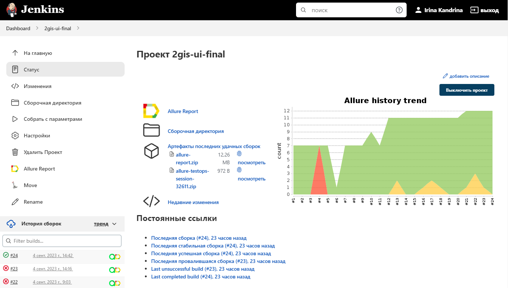
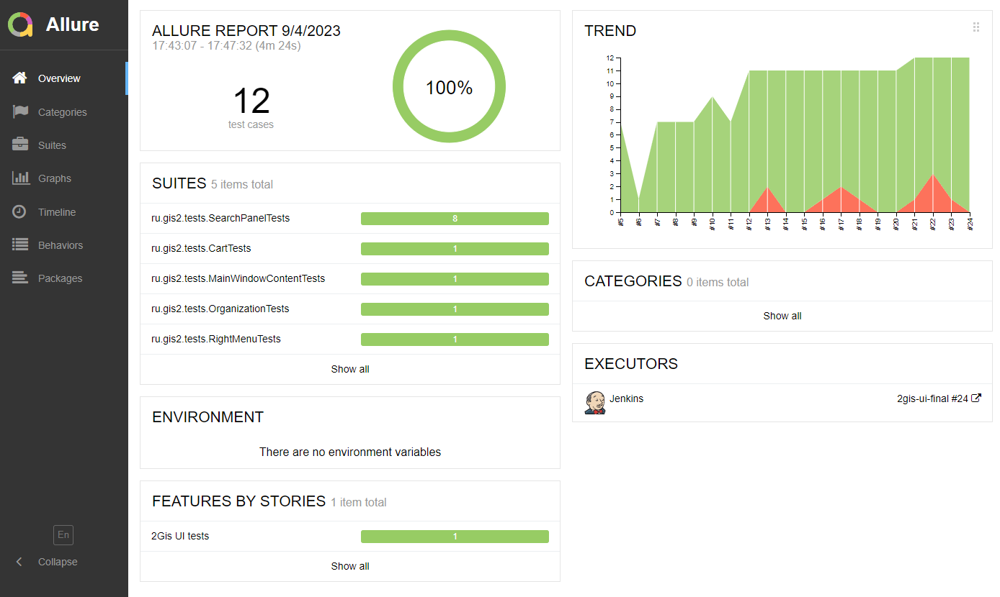

# Проект по автоматизации тестирования для компании [2ГИС](https://info.2gis.ru/sankt-peterburg/) в городе Санкт-Петербург
> Картографический сервис 2ГИС —  подробный справочник организаций с детальной картой городов и навигатор для автомобиля и пешеходов.
>
> ## **Содержание:**
____

* <a href="#tools">Технологии и инструменты</a>

* <a href="#jenkins">Сборка в Jenkins</a>

* <a href="#console">Запуск из терминала</a>

* <a href="#allure">Allure отчет</a>

* <a href="#allure-testops">Интеграция с Allure TestOps</a>

* <a href="#jira">Интеграция с Jira</a>

* <a href="#telegram">Уведомление в Telegram при помощи бота</a>

* <a href="#video">Примеры видео выполнения тестов на Selenoid</a>
____
<a id="tools"></a>
## <a name="Технологии и инструменты">**Технологии и инструменты:**</a>

<p align="center">  
<a href="https://www.jetbrains.com/idea/"></a>  
<a href="https://www.java.com/"></a>  
<a href="https://github.com/"></a>  
<a href="https://junit.org/junit5/"></a>  
<a href="https://gradle.org/"></a>  
<a href="https://selenide.org/"></a>  
<a href="https://aerokube.com/selenoid/"></a>  
<a href="ht[images](images)tps://github.com/allure-framework/allure2"></a> 
<a href="https://qameta.io/"></a>   
<a href="https://www.jenkins.io/"></a>  
<a href="https://www.atlassian.com/ru/software/jira/"></a>  
</p>

____
<a id="jenkins"></a>
## </a><a name="Сборка"></a>Сборка в [Jenkins](https://jenkins.autotests.cloud/job/20-irina_kandrina-15-2gis-tests/)</a>
____
<p align="center">  
<a href="https://jenkins.autotests.cloud/job/20-irina_kandrina-15-2gis-tests/"></a>  
</p>

<a id="console"></a>
## Команды для запуска из терминала
___
***Локальный запуск:***
```bash  
gradle clean gis_test
```

***Удалённый запуск через Jenkins:***
```bash  
clean
${TASK}
"-Dbrowser=${BROWSER}"
"-DbrowserSize=${BROWSER_SIZE}"
"-DbrowserVersion=${BROWSER_VERSION}"
"-DbaseUrl=${BASE_URL}"
"-DremoteUrl=${REMOTE_URL}"
```
___
<a id="allure"></a>
## </a> <a name="Allure"></a>Allure [отчет](https://jenkins.autotests.cloud/job/20-irina_kandrina-15-2gis-tests/7/allure/)</a>
___

### *Основная страница отчёта*

<p align="center">  
  
</p>  


